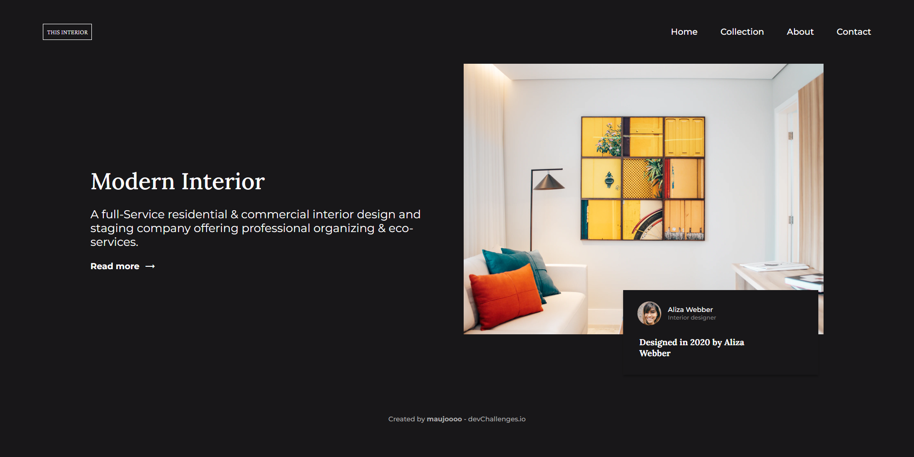
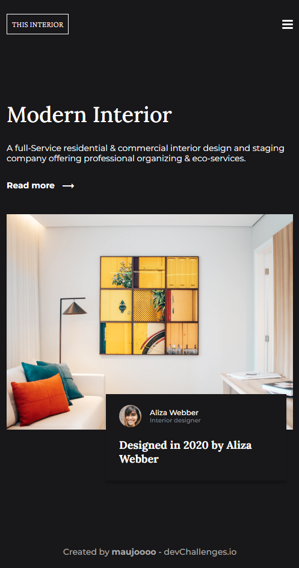
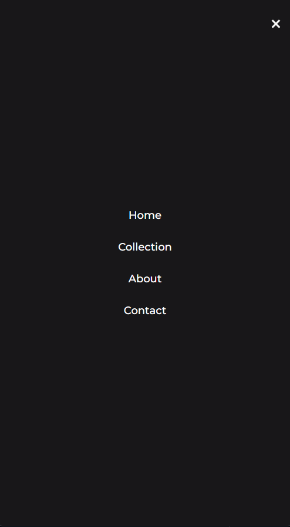

# Interior Consultant
## Description
First website for practice my skills with responsive design and BEM methodologies. Design from [interior-consultant-design](https://devchallenges.io/challenges/Jymh2b2FyebRTUljkNcb).

## Screenshots

  
Desktop

  

  
Mobile

  

    
    
  

## Thanks to
- [devchallenges.io](https://devchallenges.io/)
